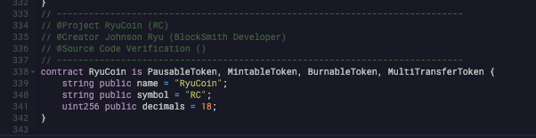
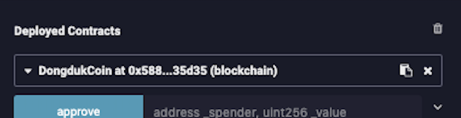
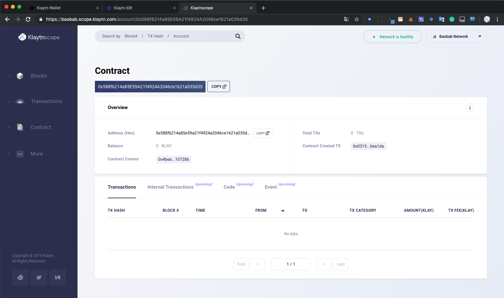
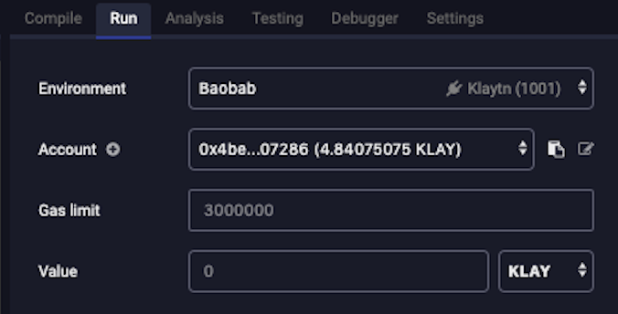
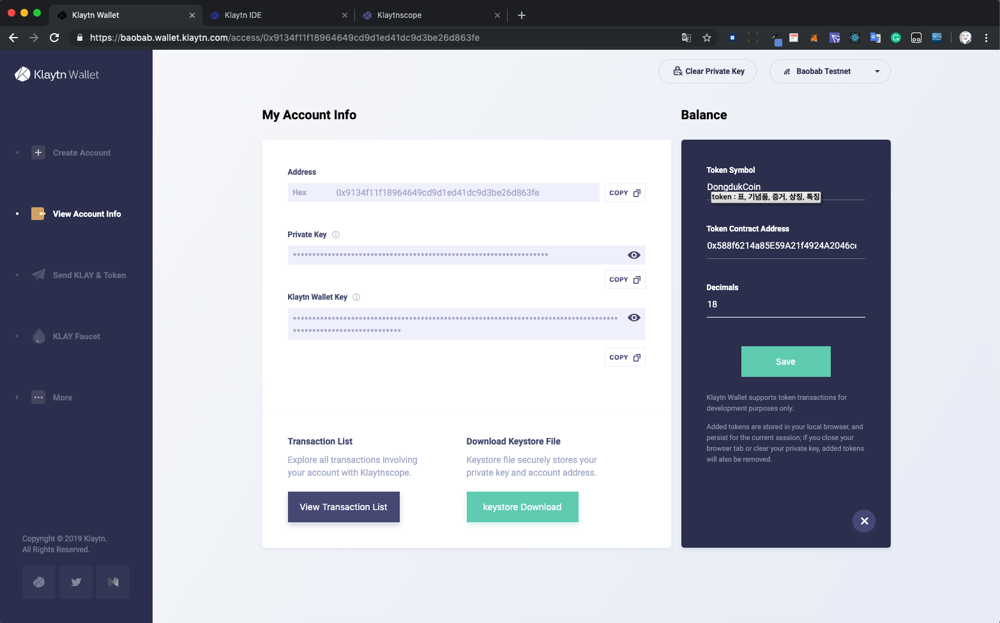
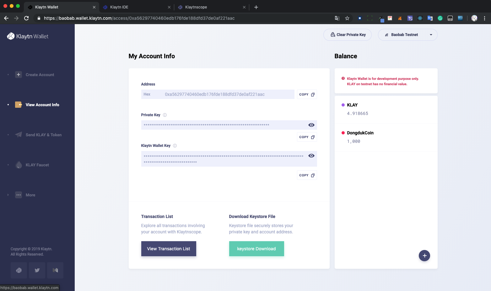

# Klaytn을 활용한 ERC20 토큰 만들기

## 1. Create Account [(링크)](https://baobab.wallet.klaytn.com/)


Create Account를 눌러서 Account 생성하고, Private Key 백업하기

## 2. Test Klay 받기 [(링크)](https://baobab.wallet.klaytn.com/access?next=faucet)


아까 백업한 Private Key를 넣어주고, Faucet을 클릭하여 5 Test_KLAY를 받는다.

## 3. Klaytn IDE 접속 [(링크)](https://ide.klaytn.com/)


Klaytn IDE에 접속하여 Custom ERC20 Code를 넣는다.

[Custom ERC20 Full Code](https://github.com/JohnsonRyu/CustomERC/blob/master/%EB%A5%98RC20.sol)

## 4. Account 추가 하기


Run탭에서 Account를 추가 한다. Private Key는 1번에서 생성한 계정으로 추가 한다.


## 5. Token 이름 정하기



자신이 원하는 코인 name, symbol로 수정 한다.
그리고 `Ctrl+S`를 눌러 컴파일 한다.

```
contract DongdukCoin is PausableToken, MintableToken, BurnableToken, MultiTransferToken {
    string public name = "DongdukCoin";
    string public symbol = "DDC";
    uint256 public decimals = 18;
}
```

## 6. Contract Deploy


변경한 || 그대로인 Contract 이름으로 Deply를 진행한다.

## 7. Klaytn Scope [(링크)](https://baobab.scope.klaytn.com/)



우측 문서 표시를 클릭해 Contract Address를 복사 한 후, Klaytn Scope에 들어가 검색해본다.



정상 적으로 생성 되었다면, Contract Creator에 자신의 Public Key가 적혀있을 것이다.

## 8. 토큰 발행 하기



다시 Klaytn IDE로 돌아가, 자신의 Public Address를 복사 한다.


`mint`함수에 자신의 주소와 원하는 발행량을 입력한다.

> 이 때 원하는 발행량에 decimals 만큼의 0을 붙인다. `n개 * 10**uint(decimals);`
> 1000개 발행시 1000`000000000000000000`


## 9. Klaytn Wallet에 내 토큰 추가하기



차례대로 `Token Symbol`(5번 참고)  `Token Contract Address`(7번 참고) `Decimals`를 입력한다.

