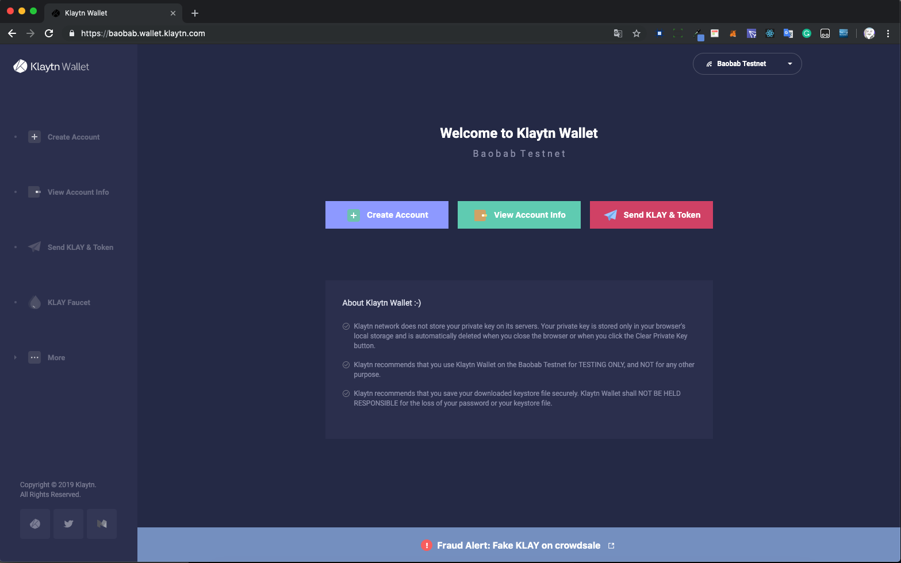
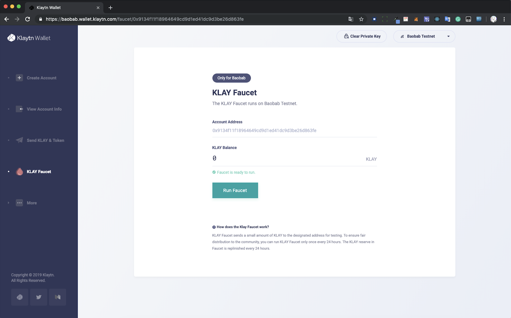
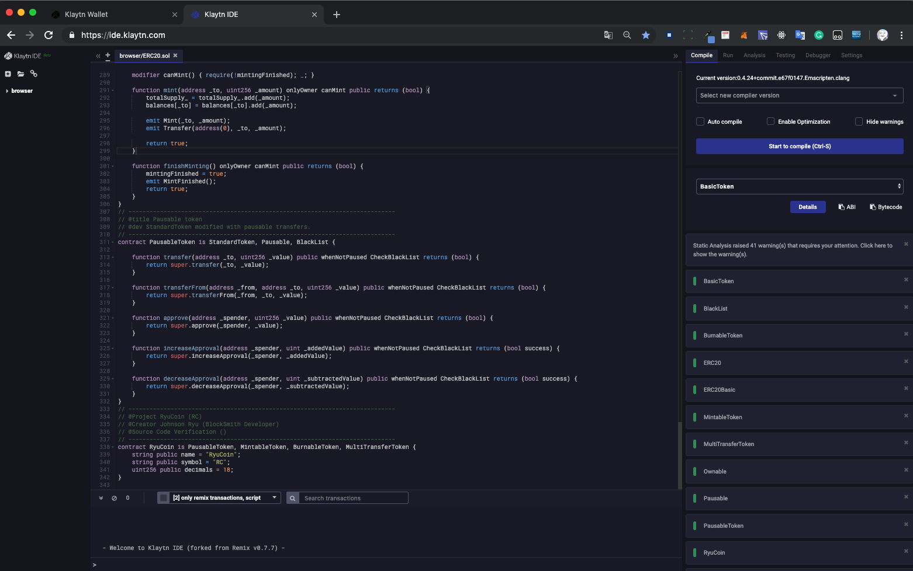

# Klaytn을 활용한 ERC20 토큰 만들기

## 1. Create Account [(링크)](https://baobab.wallet.klaytn.com/)



```
Create Account를 눌러서 Account 생성하고, Private Key 백업하기
```

## 2. Test Klay 받기 [(링크)](https://baobab.wallet.klaytn.com/access?next=faucet)



```
아까 백업한 Private Key를 넣어주고, Faucet을 클릭하여 5 Test_KLAY를 받는다.
```

## 3. Klaytn IDE 접속 [(링크)](https://ide.klaytn.com/)



```
Klaytn IDE에 접속하여 Custom ERC20 Code를 넣는다.

[Custom ERC20 Full Code](https://github.com/JohnsonRyu/CustomERC/blob/master/%EB%A5%98RC20.sol)
```

## 4. Compile 후 Account 추가 하기


```
`Ctrl+S`로 컴파일 후, Run탭에서 Account를 추가 한다. Private Key는 1번에서 생성한 계정으로 추가 한다.
```
